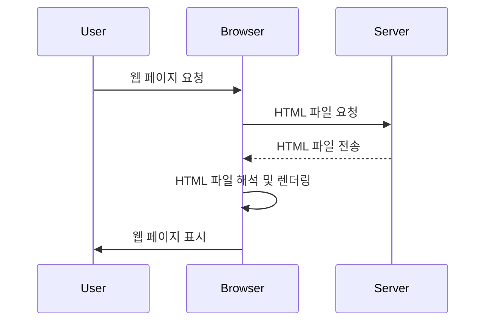
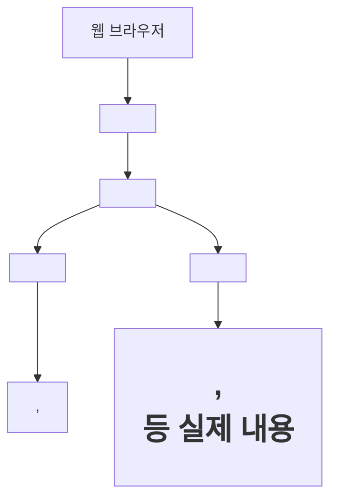
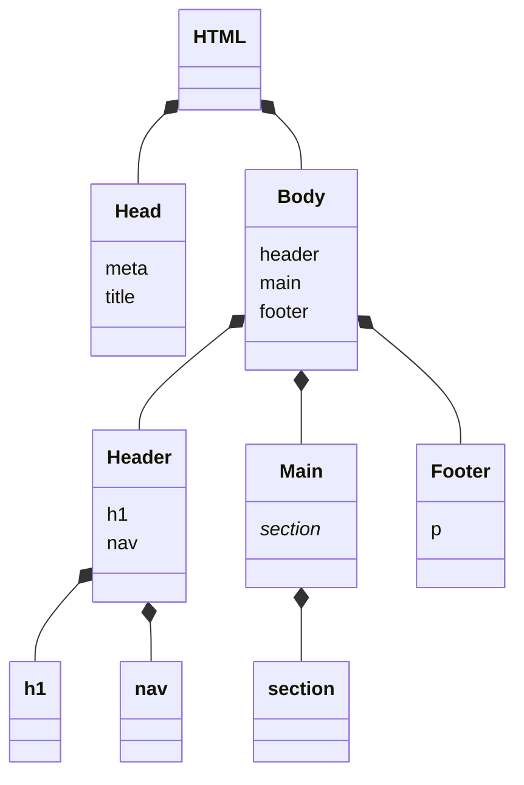
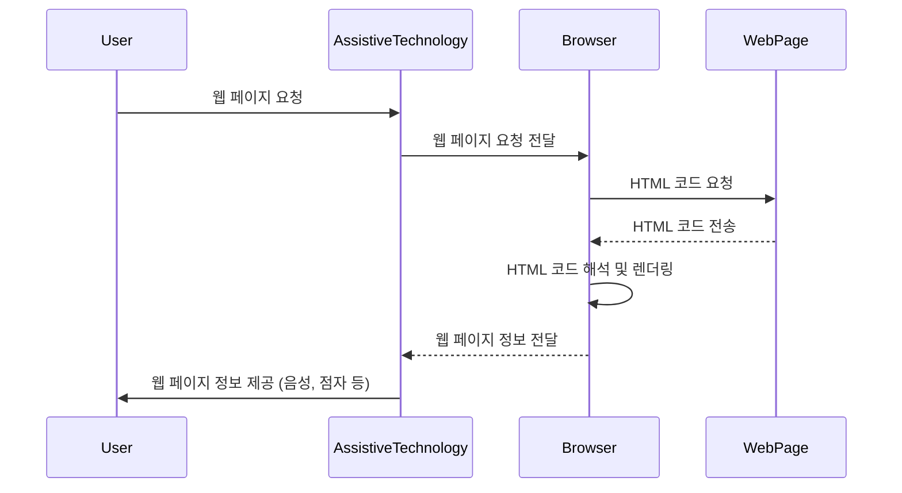

## 서문

안녕하세요, 여러분! 이번 가이드에서는 웹 개발의 기초인 HTML에 대해 깊이 있게 알아보겠습니다. HTML은 웹 페이지의 구조를 정의하는 마크업 언어로, 모든 웹 개발자가 반드시 알아야 할 핵심 기술입니다. 초보자부터 고급 개발자까지 HTML을 잘 이해하고 활용한다면 더욱 의미 있고 접근성 높은 웹 페이지를 만들 수 있을 것입니다.

이 가이드에서는 HTML의 개념, 역사, 문법, 주요 태그 등을 상세히 다루어 여러분의 웹 개발 실력 향상에 도움이 되고자 합니다.

그럼 지금부터 HTML의 세계로 빠져볼까요? 함께 공부하며 성장하는 시간이 되길 바랍니다!

## 목차

1. HTML 소개
   - HTML의 정의와 웹에서의 역할
   - HTML의 역사와 버전별 특징 (HTML4, XHTML, HTML5)
   - 웹 표준과 HTML의 중요성
2. HTML 기본 문법
   - 태그(Tag)와 요소(Element)
   - 속성(Attribute)과 값(Value)
   - 주석(Comment)
3. HTML 문서 구조
   - <!DOCTYPE> 선언
   - <html>, <head>, <body> 태그
   - 메타데이터와 <meta> 태그
4. 텍스트 요소
   - 제목(Heading) 태그: <h1> ~ <h6>
   - 단락(Paragraph) 태그: <p>
   - 서식 태그: <strong>, <em>, <u>, <s> 등
5. 링크와 이미지
   - 하이퍼링크: <a> 태그
   - 이미지 삽입:  태그
6. 목록과 표
   - 순서 있는 목록(Ordered List): <ol>과 <li> 태그
   - 순서 없는 목록(Unordered List): <ul>과 <li> 태그
   - 테이블 생성: <table>, <tr>, <th>, <td> 태그
7. 폼(Form) 요소
   - <form> 태그와 속성
   - 다양한 <input> 유형
   - <label>, <select>, <textarea>, <button> 태그
8. 시맨틱 웹
   - 시맨틱 태그의 개념과 종류
   - HTML5에서 추가된 시맨틱 태그
9. 실전 예제
   - 간단한 개인 웹 페이지 만들기
   - 블로그 포스트 페이지 구조 잡기
   - 제품 소개 페이지 레이아웃 구성하기

---

# 1. HTML 소개

## HTML의 정의와 웹에서의 역할

HTML(HyperText Markup Language)은 웹 페이지의 구조와 내용을 정의하는 마크업 언어입니다. HTML은 웹 브라우저에게 웹 페이지의 콘텐츠와 구조를 알려주는 역할을 합니다. 웹 개발자는 HTML을 사용하여 텍스트, 이미지, 비디오, 링크 등 다양한 요소를 배치하고 구성함으로써 웹 페이지를 만들어냅니다.

HTML의 동작 원리를 간단히 나타내면 다음과 같습니다:



1. 사용자(User)가 웹 브라우저(Browser)를 통해 웹 페이지를 요청합니다.
2. 웹 브라우저는 서버(Server)에 해당 웹 페이지의 HTML 파일을 요청합니다.
3. 서버는 요청받은 HTML 파일을 웹 브라우저에게 전송합니다.
4. 웹 브라우저는 전송받은 HTML 파일을 해석하고 렌더링합니다.
5. 웹 브라우저는 렌더링된 웹 페이지를 사용자에게 표시합니다.

이처럼 HTML은 웹 페이지의 뼈대를 구성하는 핵심 기술로, 웹 브라우저와 서버 간의 통신을 통해 사용자에게 웹 페이지를 제공하는 데 필수적인 역할을 합니다.

## HTML의 역사와 버전별 특징

HTML의 역사는 웹의 발전과 함께해왔습니다. 1990년대 초반, 팀 버너스리(Tim Berners-Lee)가 HTML의 초기 버전을 개발한 이후로 HTML은 꾸준히 발전해왔습니다. 주요 HTML 버전과 그 특징을 살펴보겠습니다.

### HTML 4.01 (1999)

- HTML 4.01은 이전 버전의 HTML을 정리하고 표준화한 버전입니다.
- 스타일 시트(CSS)와 자바스크립트(JavaScript)를 공식적으로 지원하기 시작했습니다.
- 프레임(Frame)과 같은 새로운 요소가 추가되었습니다.

### XHTML 1.0 (2000)

- XHTML(eXtensible HyperText Markup Language)은 HTML을 XML(eXtensible Markup Language)[^1]의 규칙에 맞게 재정의한 버전입니다.
- XHTML은 HTML보다 더 엄격한 문법 규칙을 가지고 있어, 웹 페이지의 호환성과 접근성을 높이는 데 기여했습니다.

[^1]: XML(eXtensible Markup Language)은 데이터를 구조화하고 전송하기 위한 마크업 언어로, HTML과 달리 태그와 속성을 사용자가 직접 정의할 수 있습니다.

### HTML5 (2014)

- HTML5는 HTML 4.01 이후 약 15년 만에 등장한 차세대 HTML 표준입니다.
- HTML5는 플러그인 없이도 멀티미디어 요소를 지원하는 <audio>, <video> 태그를 도입했습니다.
- 시맨틱 태그(Semantic Tag)[^2]를 도입하여 웹 페이지의 구조를 더욱 의미 있게 나타낼 수 있게 되었습니다.
- 캔버스(Canvas), 로컬 스토리지(Local Storage), 웹 소켓(Web Socket) 등 다양한 API를 지원하여 웹 애플리케이션 개발 기능을 강화했습니다.

[^2]: 시맨틱 태그(Semantic Tag)는 웹 페이지의 각 영역을 의미론적으로 나타내는 태그로, <header>, <nav>, <main>, <article>, <section>, <aside>, <footer> 등이 있습니다. 시맨틱 태그를 사용하면 웹 페이지의 구조를 더욱 명확하게 나타낼 수 있어 접근성과 SEO(검색 엔진 최적화)에 도움이 됩니다.

HTML 버전별 특징을 도식화하면 다음과 같습니다:

```
+-----------+       +-----------+       +-----------+
|  HTML 4.01|       |  XHTML 1.0|       |   HTML5   |
+-----------+       +-----------+       +-----------+
|   - CSS   |       | - 엄격한  |       | - 멀티미디|
|   - 자바스|       |   문법 규 |       | 어 지원   |
|     크립트|       |   칙      |       | - 시맨틱  |
|   - 프레임|       | - XML 기반|       |   태그    |
|           |       |           |       | - 다양한  |
|           |       |           |       |   API 지원|
+-----------+       +-----------+       +-----------+
```

## 웹 표준과 HTML의 중요성

웹 표준(Web Standards)은 웹 페이지를 만들 때 따라야 할 공식 규격이나 지침을 말합니다. 웹 표준을 준수하면 웹 페이지의 호환성, 접근성, 유지보수성 등을 높일 수 있습니다. HTML은 웹 표준의 핵심으로, 다음과 같은 중요성을 가집니다:

1. 호환성(Cross-browser Compatibility): 웹 표준을 준수한 HTML 코드는 다양한 웹 브라우저에서 동일하게 동작합니다. 이는 사용자가 어떤 브라우저를 사용하더라도 일관된 경험을 제공할 수 있게 해줍니다.

2. 접근성(Accessibility): 웹 표준을 준수한 HTML 코드는 장애인, 고령자 등 웹 접근성이 중요한 사용자들도 웹 페이지에 접근하고 이용할 수 있도록 도와줍니다. 이는 웹의 개방성과 평등성을 높이는 데 기여합니다.

3. 유지보수성(Maintainability): 웹 표준을 준수한 HTML 코드는 읽기 쉽고 구조적이며 일관성이 있습니다. 이는 개발자가 코드를 이해하고 유지보수하는 데 도움을 줍니다.

4. 검색 엔진 최적화(Search Engine Optimization, SEO): 웹 표준을 준수한 HTML 코드는 검색 엔진이 웹 페이지의 내용을 더 잘 이해하고 색인할 수 있도록 해줍니다. 이는 웹 페이지의 검색 순위를 높이고 더 많은 사용자를 유치하는 데 도움이 됩니다.

웹 표준과 HTML의 관계를 도식화하면 다음과 같습니다:

```
  +--------------+
  |  웹 표준     |
  |  (Web        |
  |  Standards)  |
  +--------------+
         |
         |
  +--------------+
  |     HTML     |
  |              |
  |  - 호환성    |
  |  - 접근성    |
  |  - 유지보수성|
  |  - SEO       |
  +--------------+
```

따라서 웹 개발자는 HTML을 사용할 때 웹 표준을 준수하여 호환성, 접근성, 유지보수성을 높이고 검색 엔진 최적화에 도움이 되도록 해야 합니다. 이를 위해 W3C(World Wide Web Consortium)와 WHATWG(Web Hypertext Application Technology Working Group) 등 웹 표준화 기구의 문서와 가이드라인을 참고하는 것이 좋습니다.

> **예제 1: 간단한 HTML 문서 구조**

```html
<!DOCTYPE html>
<html lang="ko">
  <head>
    <meta charset="UTF-8" />
    <meta name="viewport" content="width=device-width, initial-scale=1.0" />
    <title>간단한 HTML 문서</title>
  </head>
  <body>
    <h1>웹 표준과 HTML</h1>
    <p>
      웹 표준을 준수한 HTML 코드는 다양한 웹 브라우저에서 동일하게 동작합니다.
    </p>
    <p>
      이는 사용자에게 일관된 경험을 제공하고, 웹 접근성과 유지보수성을 높이는 데
      도움이 됩니다.
    </p>
  </body>
</html>
```

위 예제는 웹 표준을 준수한 간단한 HTML 문서 구조입니다. `<!DOCTYPE html>` 선언으로 HTML5 문서임을 나타내고, `<html>`, `<head>`, `<body>` 태그를 사용하여 구조를 잡았습니다. 이런 기본 구조를 따르는 것이 웹 표준을 지키는 첫걸음이 될 수 있습니다.



> \*\*예제 2:
> **예제 2: 시맨틱 태그를 사용한 HTML 문서 구조**

```html
<!DOCTYPE html>
<html lang="ko">
  <head>
    <meta charset="UTF-8" />
    <meta name="viewport" content="width=device-width, initial-scale=1.0" />
    <title>시맨틱 태그를 사용한 HTML 문서</title>
  </head>
  <body>
    <header>
      <h1>웹 표준과 HTML</h1>
      <nav>
        <ul>
          <li><a href="#intro">소개</a></li>
          <li><a href="#importance">중요성</a></li>
          <li><a href="#example">예제</a></li>
        </ul>
      </nav>
    </header>

    <main>
      <section id="intro">
        <h2>HTML 소개</h2>
        <p>HTML은 웹 페이지의 구조와 내용을 정의하는 마크업 언어입니다.</p>
      </section>

      <section id="importance">
        <h2>웹 표준과 HTML의 중요성</h2>
        <p>
          웹 표준을 준수한 HTML 코드는 호환성, 접근성, 유지보수성을 높입니다.
        </p>
      </section>

      <section id="example">
        <h2>예제</h2>
        <p>이 문서는 시맨틱 태그를 사용한 HTML 문서 구조의 예제입니다.</p>
      </section>
    </main>

    <footer>
      <p>Copyright © 2023 John Doe. All rights reserved.</p>
    </footer>
  </body>
</html>
```

위 예제는 시맨틱 태그를 사용하여 HTML 문서 구조를 의미론적으로 나타낸 것입니다. `<header>`, `<nav>`, `<main>`, `<section>`, `<footer>` 등의 태그를 사용하여 문서의 각 영역을 명확히 구분하였습니다. 이렇게 시맨틱 태그를 사용하면 코드의 가독성과 유지보수성이 향상되며, 검색 엔진 최적화와 웹 접근성에도 도움이 됩니다.



> **예제 3: 웹 접근성을 고려한 HTML 코드**

```html
<!DOCTYPE html>
<html lang="ko">
  <head>
    <meta charset="UTF-8" />
    <meta name="viewport" content="width=device-width, initial-scale=1.0" />
    <title>웹 접근성을 고려한 HTML 코드</title>
  </head>
  <body>
    <h1>웹 접근성 예제</h1>
    <p>다음은 웹 접근성을 고려한 이미지 태그의 예제입니다:</p>

    

    <p>
      <a href="https://www.w3.org/" target="_blank">
        W3C 웹사이트 바로가기
        <span>(새 창에서 열림)</span>
      </a>
    </p>
  </body>
</html>
```

위 예제는 웹 접근성을 고려하여 HTML 코드를 작성한 것입니다. `` 태그에 `alt` 속성을 사용하여 시각장애인 사용자를 위한 대체 텍스트를 제공하였습니다. 또한, `<a>` 태그로 링크를 삽입할 때 `target="_blank"` 속성을 사용하여 새 창에서 링크가 열리도록 하였고, 이를 시각장애인 사용자에게 알리기 위해 `<span>` 태그를 사용하여 추가 설명을 제공하였습니다.



이상으로 HTML 소개 부분을 마치겠습니다. 다음 장에서는 HTML의 기본 문법과 태그에 대해 자세히 알아보겠습니다. HTML을 잘 이해하고 웹 표준을 준수하여 코딩한다면, 누구나 접근 가능한 고품질의 웹 페이지를 만들 수 있을 것입니다.
