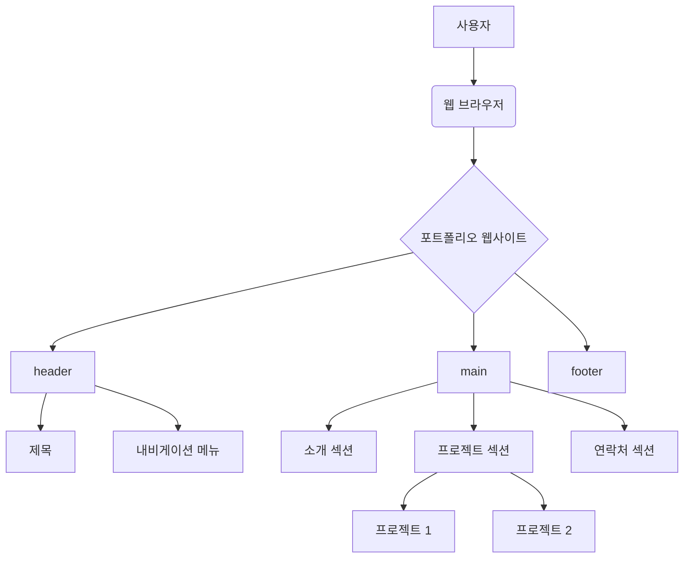
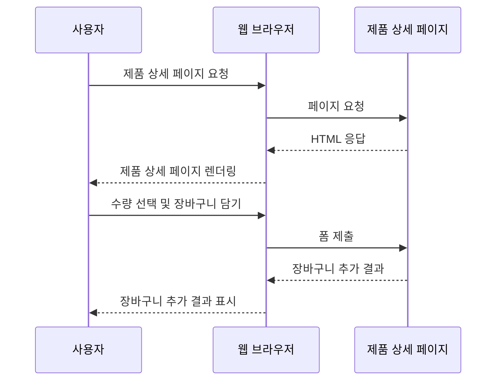
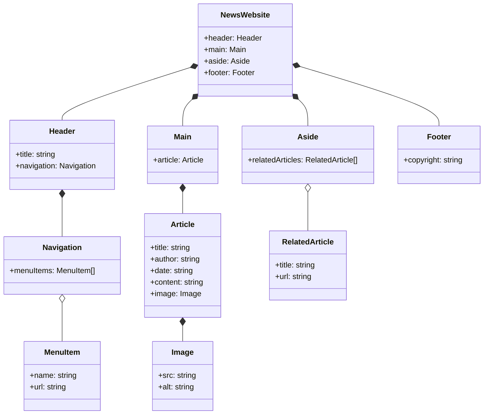

## 목차

1. HTML 기본 구조
   - `<!DOCTYPE>` 선언
   - `<html>` 태그
   - `<head>` 태그
   - `<body>` 태그
2. 텍스트 태그와 속성
3. 링크와 이미지 태그
4. 리스트와 테이블 태그
5. 폼(Form) 태그와 입력 요소
6. 시맨틱 태그와 레이아웃
7. 실전 예제

## 1. HTML 기본 구조

HTML 문서는 기본적으로 다음과 같은 구조를 가지고 있습니다.

```html
<!DOCTYPE html>
<html>
  <head>
    <title>문서 제목</title>
  </head>
  <body>
    <!-- 문서 내용 -->
  </body>
</html>
```

### `<!DOCTYPE>` 선언

`<!DOCTYPE>` 선언은 HTML 문서의 가장 첫 줄에 위치하며, 웹 브라우저에게 현재 문서가 HTML5 문서임을 알려줍니다. 이를 통해 웹 브라우저는 HTML5 표준에 맞게 문서를 해석하고 렌더링합니다.

### `<html>` 태그

`<html>` 태그는 HTML 문서의 루트(root) 요소로, 문서의 시작과 끝을 나타냅니다. 모든 HTML 요소는 `<html>` 태그 내부에 위치해야 합니다.

### `<head>` 태그

`<head>` 태그는 문서의 메타데이터(metadata)를 포함하는 영역입니다. 메타데이터는 문서 제목, 인코딩 방식, 외부 파일 링크 등 문서에 대한 정보를 담고 있습니다. `<head>` 태그 내부에는 `<title>`, `<meta>`, `<link>`, `<style>`, `<script>` 등의 태그가 올 수 있습니다.

### `<body>` 태그

`<body>` 태그는 웹 페이지에 실제로 표시되는 내용을 포함하는 영역입니다. 텍스트, 이미지, 비디오, 오디오, 링크 등 다양한 요소들이 `<body>` 태그 내부에 위치합니다.

HTML 기본 구조의 동작 원리를 아스키 아트로 표현하면 다음과 같습니다.

```
+------------------+
|    <!DOCTYPE>    |
+------------------+
|     <html>       |
|  +------------+  |
|  |   <head>   |  |
|  +------------+  |
|  +------------+  |
|  |   <body>   |  |
|  +------------+  |
+------------------+
```

## 2. 텍스트 태그와 속성

HTML에서는 다양한 텍스트 태그를 사용하여 문서의 구조와 의미를 표현할 수 있습니다. 주요 텍스트 태그와 속성은 다음과 같습니다.

### 제목 태그 (`<h1>` ~ `<h6>`)

제목 태그는 문서의 제목이나 부제목을 나타내는 데 사용됩니다. `<h1>`부터 `<h6>`까지 6단계의 제목 태그가 있으며, 숫자가 작을수록 더 높은 수준의 제목을 의미합니다.

```html
<h1>가장 큰 제목</h1>
<h2>두 번째로 큰 제목</h2>
<h3>세 번째로 큰 제목</h3>
<h4>네 번째로 큰 제목</h4>
<h5>다섯 번째로 큰 제목</h5>
<h6>여섯 번째로 큰 제목</h6>
```

### 단락 태그 (`<p>`)

단락 태그는 문서의 단락을 나타내는 데 사용됩니다. 단락 간에는 자동으로 빈 줄이 삽입되어 시각적으로 구분됩니다.

```html
<p>첫 번째 단락입니다.</p>
<p>두 번째 단락입니다.</p>
```

### 텍스트 서식 태그

텍스트 서식 태그는 텍스트의 모양이나 의미를 지정하는 데 사용됩니다.

- `<b>`, `<strong>`: 굵은 글씨 (bold)
- `<i>`, `<em>`: 기울임꼴 (italic)
- `<u>`: 밑줄 (underline)
- `<s>`, `<del>`: 취소선 (strikethrough)
- `<sup>`: 위 첨자 (superscript)
- `<sub>`: 아래 첨자 (subscript)

```html
<p>이 텍스트는 <b>굵은</b> 글씨입니다.</p>
<p>이 텍스트는 <i>기울임꼴</i>입니다.</p>
<p>이 텍스트는 <u>밑줄</u>이 그어져 있습니다.</p>
<p>이 텍스트는 <s>취소선</s>이 그어져 있습니다.</p>
<p>X<sup>2</sup> + Y<sup>2</sup> = Z<sup>2</sup></p>
<p>H<sub>2</sub>O는 물의 화학식입니다.</p>
```

### 속성 (Attribute)

HTML 태그는 추가 정보를 제공하는 속성을 가질 수 있습니다. 속성은 태그 이름 뒤에 속성명="속성값" 형태로 작성합니다.

```html
<p title="마우스를 올리면 보입니다">이 단락에는 title 속성이 있습니다.</p>
<p style="color: blue;">이 단락은 파란색 텍스트입니다.</p>
<p class="highlight">이 단락은 highlight 클래스를 가지고 있습니다.</p>
```

- `title`: 요소에 대한 추가 정보를 제공하며, 마우스를 올리면 툴팁(tooltip)으로 표시됩니다.
- `style`: 요소에 직접 CSS 스타일을 적용합니다.
- `class`: 요소에 클래스명을 지정하여 CSS 또는 JavaScript에서 선택할 수 있도록 합니다.

## 3. 링크와 이미지 태그

HTML에서는 `<a>` 태그를 사용하여 다른 웹 페이지나 문서로 연결되는 하이퍼링크를 만들 수 있습니다. 또한 `` 태그를 사용하여 이미지를 삽입할 수 있습니다.

### 링크 태그 (`<a>`)

`<a>` 태그는 하이퍼링크를 만드는 데 사용됩니다. `href` 속성을 사용하여 링크할 대상의 URL을 지정합니다.

```html
<a href="https://www.example.com">링크 텍스트</a>
<a href="other-page.html">다른 페이지로 이동</a>
<a href="#section1">문서 내의 특정 위치로 이동</a>
```

- 외부 URL 링크: `https://`, `http://`로 시작하는 절대 경로를 지정합니다.
- 내부 페이지 링크: 같은 웹 사이트 내의 다른 HTML 파일명을 지정합니다.
- 문서 내 링크: `#`으로 시작하는 요소의 `id` 속성값을 지정하여 문서 내의 특정 위치로 이동할 수 있습니다.

### 이미지 태그 (``)

`` 태그는 웹 페이지에 이미지를 삽입하는 데 사용됩니다. `src` 속성을 사용하여 이미지 파일의 경로를 지정합니다.

```html

```

- `src`: 이미지 파일의 경로를 지정합니다. 절대 경로 또는 상대 경로를 사용할 수 있습니다.
- `alt`: 이미지를 표시할 수 없는 경우 대체 텍스트를 제공합니다. 접근성 및 SEO를 위해 중요합니다.

## 4. 리스트와 테이블 태그

HTML에서는 리스트와 테이블을 만들기 위한 태그를 제공합니다. 리스트에는 순서가 있는 리스트(`<ol>`)와 순서가 없는 리스트(`<ul>`)가 있으며, 테이블은 `<table>` 태그를 사용하여 만들 수 있습니다.

### 순서가 있는 리스트 (`<ol>`)

`<ol>` 태그는 순서가 있는 리스트를 만드는 데 사용됩니다. 각 항목은 `<li>` 태그로 표현합니다.

```html
<ol>
  <li>첫 번째 항목</li>
  <li>두 번째 항목</li>
  <li>세 번째 항목</li>
</ol>
```

### 순서가 없는 리스트 (`<ul>`)

`<ul>` 태그는 순서가 없는 리스트를 만드는 데 사용됩니다. 각 항목은 `<li>` 태그로 표현합니다.

```html
<ul>
  <li>항목 1</li>
  <li>항목 2</li>
  <li>항목 3</li>
</ul>
```

### 테이블 태그 (`<table>`)

`<table>` 태그는 데이터를 행과 열로 구성된 테이블 형태로 표현하는 데 사용됩니다.

```html
<table>
  <tr>
    <th>헤더 1</th>
    <th>헤더 2</th>
  </tr>
  <tr>
    <td>데이터 1</td>
    <td>데이터 2</td>
  </tr>
  <tr>
    <td>데이터 3</td>
    <td>데이터 4</td>
  </tr>
</table>
```

- `<tr>`: 테이블의 행(row)을 정의합니다.
- `<th>`: 테이블의 헤더 셀을 정의합니다.
- `<td>`: 테이블의 일반 셀
  을 정의합니다.

## 5. 폼(Form) 태그와 입력 요소

HTML 폼은 사용자로부터 입력을 받아 서버로 전송하는 데 사용됩니다. 폼은 `<form>` 태그로 시작하며, 다양한 입력 요소를 포함할 수 있습니다.

### 폼 태그 (`<form>`)

`<form>` 태그는 사용자 입력을 받기 위한 HTML 폼을 정의합니다.

```html
<form action="/submit" method="post">
  <!-- 입력 요소들 -->
</form>
```

- `action`: 폼 데이터를 제출할 서버 URL을 지정합니다.
- `method`: 폼 데이터를 전송할 HTTP 메서드(GET 또는 POST)를 지정합니다.

### 입력 요소

폼 내부에는 다양한 입력 요소를 사용하여 사용자로부터 데이터를 받을 수 있습니다.

- `<input>`: 텍스트, 비밀번호, 체크박스, 라디오 버튼 등 다양한 타입의 입력을 받을 수 있습니다.
- `<textarea>`: 여러 줄의 텍스트를 입력받을 수 있습니다.
- `<select>`: 드롭다운 목록에서 옵션을 선택할 수 있습니다.
- `<button>`: 폼을 제출하거나 자바스크립트 이벤트를 트리거할 수 있는 버튼을 만듭니다.

```html
<form>
  <label for="name">이름:</label>
  <input type="text" id="name" name="name" /><br />

  <label for="email">이메일:</label>
  <input type="email" id="email" name="email" /><br />

  <label for="message">메시지:</label>
  <textarea id="message" name="message"></textarea><br />

  <input type="checkbox" id="subscribe" name="subscribe" />
  <label for="subscribe">뉴스레터 구독</label><br />

  <input type="radio" id="male" name="gender" value="male" />
  <label for="male">남성</label>
  <input type="radio" id="female" name="gender" value="female" />
  <label for="female">여성</label><br />

  <select name="country">
    <option value="usa">미국</option>
    <option value="canada">캐나다</option>
    <option value="uk">영국</option></select
  ><br />

  <button type="submit">제출</button>
</form>
```

## 6. 시맨틱 태그와 레이아웃

HTML5에서는 문서의 구조와 의미를 명확히 전달하기 위해 시맨틱 태그(Semantic Tags)를 도입했습니다. 시맨틱 태그를 사용하면 검색 엔진 최적화(SEO)와 접근성이 향상되며, 코드의 가독성과 유지보수성도 높일 수 있습니다.

### 시맨틱 태그

- `<header>`: 문서나 섹션의 헤더를 정의합니다.
- `<nav>`: 내비게이션 링크의 집합을 정의합니다.
- `<main>`: 문서의 주요 콘텐츠를 정의합니다.
- `<article>`: 독립적으로 배포 또는 재사용할 수 있는 콘텐츠를 정의합니다.
- `<section>`: 문서의 일반적인 섹션을 정의합니다.
- `<aside>`: 문서의 주요 내용과 간접적으로 관련된 콘텐츠를 정의합니다.
- `<footer>`: 문서나 섹션의 푸터를 정의합니다.

```html
<body>
  <header>
    <h1>웹사이트 제목</h1>
    <nav>
      <ul>
        <li><a href="#">홈</a></li>
        <li><a href="#">소개</a></li>
        <li><a href="#">서비스</a></li>
        <li><a href="#">연락처</a></li>
      </ul>
    </nav>
  </header>

  <main>
    <article>
      <h2>글 제목</h2>
      <p>글 내용...</p>
    </article>
    <section>
      <h2>섹션 제목</h2>
      <p>섹션 내용...</p>
    </section>
  </main>

  <aside>
    <h3>사이드바</h3>
    <p>관련 정보...</p>
  </aside>

  <footer>
    <p>저작권 정보 및 연락처 등</p>
  </footer>
</body>
```

시맨틱 태그와 레이아웃의 동작 원리를 아스키 아트로 표현하면 다음과 같습니다.

```
+------------------------+
|        <header>        |
+------------------------+
|          <nav>         |
+------------------------+
|         <main>         |
|  +-----------------+   |
|  |    <article>    |   |
|  +-----------------+   |
|  +-----------------+   |
|  |    <section>    |   |
|  +-----------------+   |
+------------------------+
|        <aside>         |
+------------------------+
|        <footer>        |
+------------------------+
```

## 7. 실전 예제

지금까지 배운 HTML 태그와 개념을 활용하여 실전 예제를 만들어보겠습니다.

### 예제 1: 개인 포트폴리오 웹사이트

```html
<!DOCTYPE html>
<html>
  <head>
    <title>나의 포트폴리오</title>
  </head>
  <body>
    <header>
      <h1>나의 포트폴리오</h1>
      <nav>
        <ul>
          <li><a href="#about">소개</a></li>
          <li><a href="#projects">프로젝트</a></li>
          <li><a href="#contact">연락처</a></li>
        </ul>
      </nav>
    </header>

    <main>
      <section id="about">
        <h2>소개</h2>
        <p>안녕하세요, 저는 웹 개발자 홍길동입니다.</p>
      </section>

      <section id="projects">
        <h2>프로젝트</h2>
        <article>
          <h3>프로젝트 1</h3>
          <p>프로젝트 1에 대한 설명...</p>
        </article>
        <article>
          <h3>프로젝트 2</h3>
          <p>프로젝트 2에 대한 설명...</p>
        </article>
      </section>

      <section id="contact">
        <h2>연락처</h2>
        <p>이메일: example@example.com</p>
        <p>전화번호: 010-1234-5678</p>
      </section>
    </main>

    <footer>
      <p>&copy; 2023 나의 포트폴리오. All rights reserved.</p>
    </footer>
  </body>
</html>
```

위 예제는 개인 포트폴리오 웹사이트의 기본 구조를 보여줍니다. `<header>` 태그 안에 제목과 내비게이션 메뉴가 위치하며, `<main>` 태그 안에는 소개, 프로젝트, 연락처 섹션이 있습니다. 각 섹션은 `<section>` 태그로 구분되어 있고, 프로젝트 섹션에는 `<article>` 태그를 사용하여 개별 프로젝트를 표현했습니다.

예제 1의 동작 원리를 Mermaid 다이어그램으로 표현하면 다음과 같습니다.



위 다이어그램은 사용자가 웹 브라우저를 통해 포트폴리오 웹사이트에 접속하면, `<header>`, `<main>`, `<footer>` 섹션으로 구성된 웹 페이지가 렌더링되는 과정을 보여줍니다. `<main>` 섹션 내부에는 소개, 프로젝트, 연락처 섹션이 위치하며, 프로젝트 섹션에는 개별 프로젝트들이 표시됩니다.

### 예제 2: 제품 상세 페이지

```html
<!DOCTYPE html>
<html>
  <head>
    <title>제품 상세 페이지</title>
  </head>
  <body>
    <header>
      <h1>ABC 쇼핑몰</h1>
      <nav>
        <ul>
          <li><a href="#">홈</a></li>
          <li><a href="#">카테고리</a></li>
          <li><a href="#">장바구니</a></li>
        </ul>
      </nav>
    </header>

    <main>
      <article>
        <h2>제품명</h2>
        
        <p>제품 설명...</p>
        <p>가격: 10,000원</p>
        <form>
          <label for="quantity">수량:</label>
          <input
            type="number"
            id="quantity"
            name="quantity"
            min="1"
            value="1"
          />
          <button type="submit">장바구니 담기</button>
        </form>
      </article>
    </main>

    <footer>
      <p>&copy; 2023 ABC 쇼핑몰. All rights reserved.</p>
    </footer>
  </body>
</html>
```

위 예제는 쇼핑몰의 제품 상세 페이지를 나타냅니다. `<header>` 태그 안에는 쇼핑몰 이름과 내비게이션 메뉴가 있으며, `<main>` 태그 안에는 제품 정보를 담은 `<article>` 태그가 위치합니다. 제품 이미지, 설명, 가격, 수량 선택 폼 등이 포함되어 있습니다.

예제 2의 동작 원리를 Mermaid 시퀀스 다이어그램으로 표현하면 다음과 같습니다.



위 다이어그램은 사용자가 웹 브라우저를 통해 제품 상세 페이지를 요청하면, 서버에서 HTML 응답을 받아 페이지를 렌더링하는 과정을 보여줍니다. 사용자가 수량을 선택하고 장바구니 담기 버튼을 클릭하면, 폼이 제출되고 서버에서 장바구니에 해당 제품을 추가한 후 결과를 반환합니다. 웹 브라우저는 받은 결과를 사용자에게 표시합니다.

### 예제 3: 뉴스 기사 페이지

```html
<!DOCTYPE html>
<html>
  <head>
    <title>일일 뉴스</title>
  </head>
  <body>
    <header>
      <h1>일일 뉴스</h1>
      <nav>
        <ul>
          <li><a href="#">정치</a></li>
          <li><a href="#">경제</a></li>
          <li><a href="#">사회</a></li>
          <li><a href="#">문화</a></li>
        </ul>
      </nav>
    </header>

    <main>
      <article>
        <header>
          <h2>기사 제목</h2>
          <p>작성자 | 작성일</p>
        </header>
        <p>기사 내용...</p>
        
        <p>기사 내용 계속...</p>
      </article>
    </main>

    <aside>
      <h3>관련 기사</h3>
      <ul>
        <li><a href="#">관련 기사 1</a></li>
        <li><a href="#">관련 기사 2</a></li>
        <li><a href="#">관련 기사 3</a></li>
      </ul>
    </aside>

    <footer>
      <p>&copy; 2023 일일 뉴스. All rights reserved.</p>
    </footer>
  </body>
</html>
```

위 예제는 뉴스 기사 페이지의 구조를 보여줍니다. `<header>` 태그 안에는 뉴스 사이트 이름과 카테고리별 내비게이션 메뉴가 있습니다. `<main>` 태그 안에는 기사 내용을 담은 `<article>` 태그가 위치하며, 기사 제목, 작성자, 작성일, 기사 내용, 관련 이미지 등이 포함되어 있습니다. `<aside>` 태그에는 관련 기사 목록이 제시되어 있습니다.

예제 3의 동작 원리를 Mermaid 클래스 다이어그램으로 표현하면 다음과 같습니다.



위 다이어그램은 뉴스 기사 페이지를 구성하는 클래스들 간의 관계를 보여줍니다. `NewsWebsite` 클래스는 `Header`, `Main`, `Aside`, `Footer` 클래스를 포함합니다. `Header` 클래스는 `Navigation` 클래스를 포함하고, `Navigation` 클래스는 `MenuItem` 클래스와 연관되어 있습니다. `Main` 클래스는 `Article` 클래스를 포함하며, `Article` 클래스는 `Image` 클래스를 포함합니다. `Aside` 클래스는 `RelatedArticle` 클래스와 연관되어 있습니다.

이렇게 HTML을 사용하여 웹 페이지의 구조를 정의하고, 필요한 컨텐츠를 적절한 태그로 마크업함으로써 의미 있고 접근성 높은 웹사이트를 제작할 수 있습니다. 시맨틱 태그와 적절한 레이아웃을 활용하여 검색 엔진 최적화와 사용자 경험을 향상시킬 수 있습니다.
