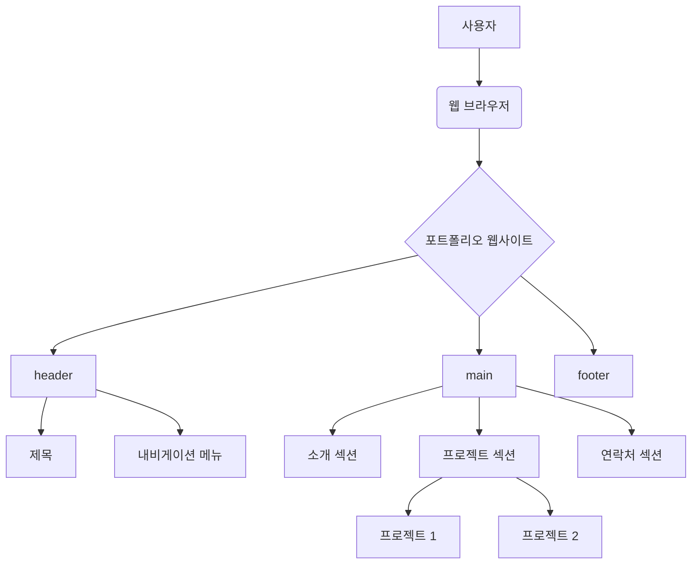
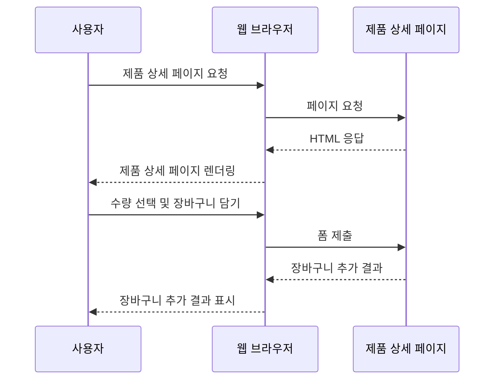
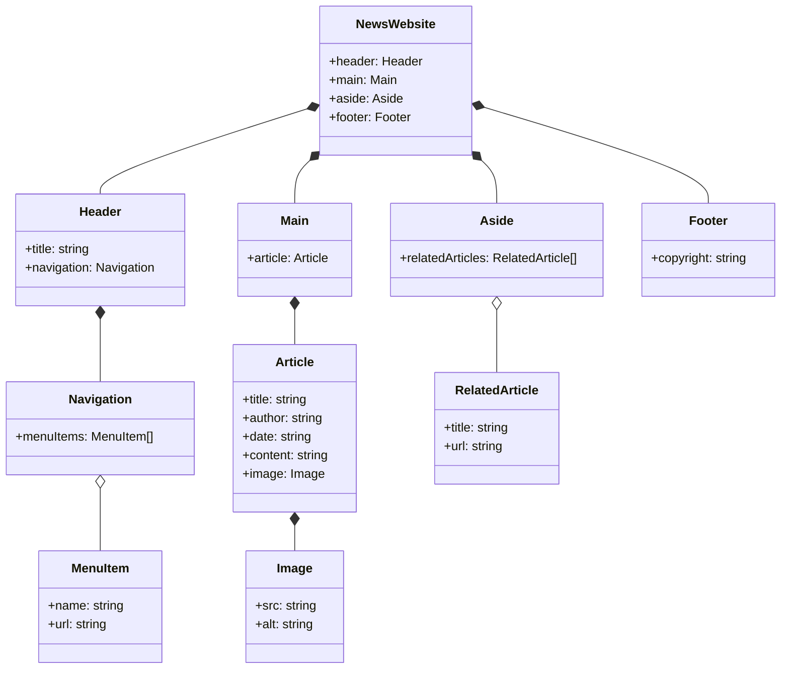

## 목차

1. HTML 기본 구조
   - `<!DOCTYPE>` 선언
   - `<html>` 태그
   - `<head>` 태그
   - `<body>` 태그
2. 텍스트 태그와 속성
3. 링크와 이미지 태그
4. 리스트와 테이블 태그
5. 폼(Form) 태그와 입력 요소
6. 시맨틱 태그와 레이아웃
7. 실전 예제

## 1. HTML 기본 구조

HTML 문서는 기본적으로 다음과 같은 구조를 가지고 있습니다.

```html
<!DOCTYPE html>
<html>
  <head>
    <title>문서 제목</title>
  </head>
  <body>
    <!-- 문서 내용 -->
  </body>
</html>
```

### 2.`<!DOCTYPE>` 선언

`<!DOCTYPE>` 선언은 HTML 문서의 가장 첫 줄에 위치하며, 웹 브라우저에게 현재 문서가 HTML5 문서임을 알려줍니다. 이를 통해 웹 브라우저는 HTML5 표준에 맞게 문서를 해석하고 렌더링합니다.

### 3.`<html>` 태그

`<html>` 태그는 HTML 문서의 루트(root) 요소로, 문서의 시작과 끝을 나타냅니다. 모든 HTML 요소는 `<html>` 태그 내부에 위치해야 합니다.

---

### 4.`<head>` 태그

`<head>` 태그는 문서의 메타데이터(metadata)를 포함하는 영역입니다. 메타데이터는 문서 제목, 인코딩 방식, 외부 파일 링크 등 문서에 대한 정보를 담고 있습니다. `<head>` 태그 내부에는 `<title>`, `<meta>`, `<link>`, `<style>`, `<script>` 등의 태그가 올 수 있습니다.

1. `<title>` 태그

```html
<head>
  <title>나의 웹페이지</title>
</head>
```

- `<title>` 태그는 문서의 제목을 나타내는 태그입니다.
- 브라우저의 제목 표시줄이나 탭에 이 제목이 표시됩니다.
- 검색 엔진은 이 제목을 웹페이지의 주요 정보로 인식하므로, 제목은 웹페이지의 내용을 잘 설명할 수 있어야 합니다.

2. `<meta>` 태그

```html
<head>
  <meta charset="UTF-8" />
  <meta name="viewport" content="width=device-width, initial-scale=1.0" />
  <meta name="keywords" content="HTML, CSS, JavaScript" />
  <meta
    name="description"
    content="웹 개발에 대한 정보를 제공하는 사이트입니다."
  />
</head>
```

- `<meta>` 태그는 다양한 메타데이터를 정의하는데 사용됩니다.
- `charset` 속성은 문서의 문자 인코딩을 지정합니다. 위의 예시에서는 UTF-8 인코딩을 사용합니다.
- `name` 속성은 메타데이터의 이름을, `content` 속성은 메타데이터의 값을 나타냅니다.
- `viewport` 메타데이터는 모바일 기기에서 웹페이지가 어떻게 표시될지를 제어합니다. 위의 예시는 뷰포트 너비를 기기 너비로 설정하고, 초기 축적 비율을 1로 설정합니다.
- `keywords`는 웹페이지의 핵심 키워드를, `description`은 웹페이지의 요약 설명을 나타냅니다. 이 정보는 검색 엔진 최적화(SEO)에 활용됩니다.

3. `<link>` 태그

```html
<head>
  <link rel="stylesheet" href="style.css" />
</head>
```

- `<link>` 태그는 외부 리소스, 주로 CSS 파일과 웹페이지를 연결할 때 사용합니다.
- `rel` 속성은 현재 문서와 연결된 문서 사이의 관계를 지정합니다. 위의 예시에서는 "stylesheet"로 설정되어 연결된 파일이 스타일시트임을 나타냅니다.
- `href` 속성은 연결된 문서의 URL을 지정합니다.

- 웹로고 등록
  웹 로고는 일반적으로 `<head>` 태그 내부에 `<link>` 태그를 사용하여 등록합니다. 이를 파비콘(favicon)이라고 하며, 웹 브라우저의 주소 표시줄이나 북마크, 탭 등에 표시되는 작은 아이콘입니다.

  1.  파비콘 이미지 준비:

      - 파비콘은 일반적으로 16x16, 32x32, 또는 64x64 픽셀 크기의 이미지입니다.
      - 파비콘은 대부분 ICO, PNG, GIF 등의 이미지 포맷을 사용합니다.

  1.  HTML 파일의 `<head>` 태그 내부에 파비콘 링크 추가:

  ```html
  <head>
    <link
      rel="icon"
      type="image/png"
      sizes="32x32"
      href="/path/to/favicon-32x32.png"
    />
    <link
      rel="icon"
      type="image/png"
      sizes="16x16"
      href="/path/to/favicon-16x16.png"
    />
  </head>
  ```

  - `rel="icon"` 속성은 링크된 파일이 파비콘임을 나타냅니다.
  - `type` 속성은 파비콘 이미지의 MIME 타입을 지정합니다. (예: `image/png`, `image/x-icon` 등) : 미디어 *타입* (Multipurpose Internet Mail Extensions 또는 _MIME type)
  - `sizes` 속성은 파비콘 이미지의 크기를 나타냅니다.
  - `href` 속성은 파비콘 이미지 파일의 경로를 지정합니다.

4. `<style>` 태그

```html
<head>
  <style>
    body {
      background-color: #f0f0f0;
      font-family: Arial, sans-serif;
    }
  </style>
</head>
```

- `<style>` 태그는 HTML 문서 내에 CSS를 직접 정의할 때 사용합니다.
- 위의 예시에서는 `<body>` 태그에 대한 스타일을 정의하고 있습니다. 배경색을 #f0f0f0으로, 글꼴을 Arial 또는 기본 sans-serif 글꼴로 설정합니다.

5. `<script>` 태그

```html
<head>
  <script>
    console.log("Hello, world!");
  </script>
  <script src="script.js"></script>
</head>
```

- `<script>` 태그는 JavaScript 코드를 문서에 포함하거나 외부 JavaScript 파일을 연결할 때 사용합니다.
- 첫 번째 `<script>` 태그는 문서 내에 JavaScript 코드를 직접 포함합니다. 위의 예시에서는 콘솔에 "Hello, world!"를 출력합니다.
- 두 번째 `<script>` 태그는 `src` 속성을 사용하여 외부 JavaScript 파일인 "script.js"를 연결합니다.

---

### 5.`<body>` 태그

`<body>` 태그는 웹 페이지에 실제로 표시되는 내용을 포함하는 영역입니다. 텍스트, 이미지, 비디오, 오디오, 링크 등 다양한 요소들이 `<body>` 태그 내부에 위치합니다.

HTML 기본 구조의 동작 원리를 아스키 아트로 표현하면 다음과 같습니다.

```
+------------------+
|    <!DOCTYPE>    |
+------------------+
|     <html>       |
|  +------------+  |
|  |   <head>   |  |
|  +------------+  |
|  +------------+  |
|  |   <body>   |  |
|  +------------+  |
+------------------+
```

`<body>` 태그는 HTML 문서의 주요 콘텐츠를 포함하는 영역으로, 웹 페이지에서 실제로 보이는 모든 요소들을 담고 있습니다. 다음은 `<body>` 태그 내부에서 자주 사용되는 태그와 그 용도입니다.

1. 제목 태그 (`<h1>` ~ `<h6>`)

```html
<body>
  <h1>이것은 가장 큰 제목입니다</h1>
  <h2>이것은 두 번째로 큰 제목입니다</h2>
  <h3>이것은 세 번째로 큰 제목입니다</h3>
  ...
  <h6>이것은 가장 작은 제목입니다</h6>
</body>
```

- 제목 태그는 텍스트 콘텐츠의 제목을 나타내는 데 사용됩니다.
- `<h1>`이 가장 큰 제목을, `<h6>`이 가장 작은 제목을 나타냅니다.
- 제목 태그는 문서의 구조와 콘텐츠의 계층을 나타내는 데 도움이 됩니다.

2. 단락 태그 (`<p>`)

```html
<body>
  <p>이것은 첫 번째 단락입니다.</p>
  <p>이것은 두 번째 단락입니다.</p>
</body>
```

- `<p>` 태그는 텍스트 단락을 나타내는 데 사용됩니다.
- 각 `<p>` 태그는 새로운 단락을 시작합니다.

3. 이미지 태그 (``)

```html
<body>
  
</body>
```

- `` 태그는 웹 페이지에 이미지를 삽입할 때 사용합니다.
- `src` 속성은 이미지 파일의 URL을 지정합니다.
- `alt` 속성은 이미지를 설명하는 대체 텍스트를 제공하며, 이미지가 로드되지 않았을 때 표시됩니다.
- `width`와 `height` 속성은 이미지의 너비와 높이를 지정합니다. (단위: 픽셀)

4. 링크 태그 (`<a>`)

```html
<body>
  <a href="https://www.example.com">이것은 링크입니다</a>
</body>
```

- `<a>` 태그는 다른 웹 페이지, 파일, 이메일 주소, 또는 같은 페이지 내의 앵커 등 다른 URL로 연결할 때 사용합니다.
- `href` 속성은 링크의 목적지 URL을 지정합니다.

5. 목록 태그 (`<ul>`, `<ol>`, `<li>`)

```html
<body>
  <ul>
    <li>첫 번째 항목</li>
    <li>두 번째 항목</li>
    <li>세 번째 항목</li>
  </ul>

  <ol>
    <li>첫 번째 항목</li>
    <li>두 번째 항목</li>
    <li>세 번째 항목</li>
  </ol>
</body>
```

- `<ul>` 태그는 순서가 없는 목록을, `<ol>` 태그는 순서가 있는 목록을 나타냅니다.
- 목록의 각 항목은 `<li>` 태그로 표시합니다.

6. 테이블 태그 (`<table>`, `<tr>`, `<th>`, `<td>`)

```html
<body>
  <table>
    <tr>
      <th>헤더 1</th>
      <th>헤더 2</th>
    </tr>
    <tr>
      <td>데이터 1</td>
      <td>데이터 2</td>
    </tr>
  </table>
</body>
```

- `<table>` 태그는 데이터를 행과 열로 구성된 테이블 형태로 표시할 때 사용합니다.
- 테이블의 각 행은 `<tr>` 태그로, 각 열은 `<td>` 태그로 표시합니다.
- `<th>` 태그는 테이블 헤더 셀을 나타냅니다.

7. 폼 태그 (`<form>`, `<input>`, `<textarea>`, `<button>`)

```html
<body>
  <form>
    <label for="name">이름:</label>
    <input type="text" id="name" name="name" /><br />

    <label for="email">이메일:</label>
    <input type="email" id="email" name="email" /><br />

    <label for="message">메시지:</label>
    <textarea id="message" name="message"></textarea><br />

    <button type="submit">제출</button>
  </form>
</body>
```

- `<form>` 태그는 사용자로부터 입력을 받아 서버로 전송하는 데 사용됩니다.
- `<input>` 태그는 다양한 유형의 사용자 입력을 받을 수 있습니다. (텍스트, 이메일, 비밀번호, 라디오 버튼, 체크박스 등)
- `<textarea>` 태그는 여러 줄의 텍스트 입력을 받을 수 있습니다.
- `<button>` 태그는 폼을 제출하거나 자바스크립트를 실행하는 등의 작업을 수행하는 버튼을 만듭니다.

위에서 언급한 태그들 외에도 `<div>`, `<span>`, `<iframe>`, `<video>`, `<audio>` 등 다양한 태그들이 `<body>` 태그 내부에서 사용될 수 있습니다. 이러한 태그들을 조합하여 웹 페이지의 구조를 만들고 콘텐츠를 표시할 수 있습니다.

---

## 6. 시맨틱 태그와 레이아웃

HTML5에서는 문서의 구조와 의미를 명확히 전달하기 위해 시맨틱 태그(Semantic Tags)를 도입했습니다. 시맨틱 태그를 사용하면 검색 엔진 최적화(SEO)와 접근성이 향상되며, 코드의 가독성과 유지보수성도 높일 수 있습니다.

### 시맨틱 태그

- `<header>`: 문서나 섹션의 헤더를 정의합니다.
- `<nav>`: 내비게이션 링크의 집합을 정의합니다.
- `<main>`: 문서의 주요 콘텐츠를 정의합니다.
- `<article>`: 독립적으로 배포 또는 재사용할 수 있는 콘텐츠를 정의합니다.
- `<section>`: 문서의 일반적인 섹션을 정의합니다.
- `<aside>`: 문서의 주요 내용과 간접적으로 관련된 콘텐츠를 정의합니다.
- `<footer>`: 문서나 섹션의 푸터를 정의합니다.

```html
<body>
  <header>
    <h1>웹사이트 제목</h1>
    <nav>
      <ul>
        <li><a href="#">홈</a></li>
        <li><a href="#">소개</a></li>
        <li><a href="#">서비스</a></li>
        <li><a href="#">연락처</a></li>
      </ul>
    </nav>
  </header>

  <main>
    <article>
      <h2>글 제목</h2>
      <p>글 내용...</p>
    </article>
    <section>
      <h2>섹션 제목</h2>
      <p>섹션 내용...</p>
    </section>
  </main>

  <aside>
    <h3>사이드바</h3>
    <p>관련 정보...</p>
  </aside>

  <footer>
    <p>저작권 정보 및 연락처 등</p>
  </footer>
</body>
```

시맨틱 태그와 레이아웃의 동작 원리를 아스키 아트로 표현하면 다음과 같습니다.

```
+------------------------+
|        <header>        |
+------------------------+
|          <nav>         |
+------------------------+
|         <main>         |
|  +-----------------+   |
|  |    <article>    |   |
|  +-----------------+   |
|  +-----------------+   |
|  |    <section>    |   |
|  +-----------------+   |
+------------------------+
|        <aside>         |
+------------------------+
|        <footer>        |
+------------------------+
```

## 7. 실전 예제

지금까지 배운 HTML 태그와 개념을 활용하여 실전 예제를 만들어보겠습니다.

### 예제 1: 개인 포트폴리오 웹사이트

```html
<!DOCTYPE html>
<html>
  <head>
    <title>나의 포트폴리오</title>
  </head>
  <body>
    <header>
      <h1>나의 포트폴리오</h1>
      <nav>
        <ul>
          <li><a href="#about">소개</a></li>
          <li><a href="#projects">프로젝트</a></li>
          <li><a href="#contact">연락처</a></li>
        </ul>
      </nav>
    </header>

    <main>
      <section id="about">
        <h2>소개</h2>
        <p>안녕하세요, 저는 웹 개발자 홍길동입니다.</p>
      </section>

      <section id="projects">
        <h2>프로젝트</h2>
        <article>
          <h3>프로젝트 1</h3>
          <p>프로젝트 1에 대한 설명...</p>
        </article>
        <article>
          <h3>프로젝트 2</h3>
          <p>프로젝트 2에 대한 설명...</p>
        </article>
      </section>

      <section id="contact">
        <h2>연락처</h2>
        <p>이메일: example@example.com</p>
        <p>전화번호: 010-1234-5678</p>
      </section>
    </main>

    <footer>
      <p>&copy; 2023 나의 포트폴리오. All rights reserved.</p>
    </footer>
  </body>
</html>
```

위 예제는 개인 포트폴리오 웹사이트의 기본 구조를 보여줍니다. `<header>` 태그 안에 제목과 내비게이션 메뉴가 위치하며, `<main>` 태그 안에는 소개, 프로젝트, 연락처 섹션이 있습니다. 각 섹션은 `<section>` 태그로 구분되어 있고, 프로젝트 섹션에는 `<article>` 태그를 사용하여 개별 프로젝트를 표현했습니다.

예제 1의 동작 원리를 Mermaid 다이어그램으로 표현하면 다음과 같습니다.



위 다이어그램은 사용자가 웹 브라우저를 통해 포트폴리오 웹사이트에 접속하면, `<header>`, `<main>`, `<footer>` 섹션으로 구성된 웹 페이지가 렌더링되는 과정을 보여줍니다. `<main>` 섹션 내부에는 소개, 프로젝트, 연락처 섹션이 위치하며, 프로젝트 섹션에는 개별 프로젝트들이 표시됩니다.

### 예제 2: 제품 상세 페이지

```html
<!DOCTYPE html>
<html>
  <head>
    <title>제품 상세 페이지</title>
  </head>
  <body>
    <header>
      <h1>ABC 쇼핑몰</h1>
      <nav>
        <ul>
          <li><a href="#">홈</a></li>
          <li><a href="#">카테고리</a></li>
          <li><a href="#">장바구니</a></li>
        </ul>
      </nav>
    </header>

    <main>
      <article>
        <h2>제품명</h2>
        
        <p>제품 설명...</p>
        <p>가격: 10,000원</p>
        <form>
          <label for="quantity">수량:</label>
          <input
            type="number"
            id="quantity"
            name="quantity"
            min="1"
            value="1"
          />
          <button type="submit">장바구니 담기</button>
        </form>
      </article>
    </main>

    <footer>
      <p>&copy; 2023 ABC 쇼핑몰. All rights reserved.</p>
    </footer>
  </body>
</html>
```

위 예제는 쇼핑몰의 제품 상세 페이지를 나타냅니다. `<header>` 태그 안에는 쇼핑몰 이름과 내비게이션 메뉴가 있으며, `<main>` 태그 안에는 제품 정보를 담은 `<article>` 태그가 위치합니다. 제품 이미지, 설명, 가격, 수량 선택 폼 등이 포함되어 있습니다.

예제 2의 동작 원리를 Mermaid 시퀀스 다이어그램으로 표현하면 다음과 같습니다.



위 다이어그램은 사용자가 웹 브라우저를 통해 제품 상세 페이지를 요청하면, 서버에서 HTML 응답을 받아 페이지를 렌더링하는 과정을 보여줍니다. 사용자가 수량을 선택하고 장바구니 담기 버튼을 클릭하면, 폼이 제출되고 서버에서 장바구니에 해당 제품을 추가한 후 결과를 반환합니다. 웹 브라우저는 받은 결과를 사용자에게 표시합니다.

### 예제 3: 뉴스 기사 페이지

```html
<!DOCTYPE html>
<html>
  <head>
    <title>일일 뉴스</title>
  </head>
  <body>
    <header>
      <h1>일일 뉴스</h1>
      <nav>
        <ul>
          <li><a href="#">정치</a></li>
          <li><a href="#">경제</a></li>
          <li><a href="#">사회</a></li>
          <li><a href="#">문화</a></li>
        </ul>
      </nav>
    </header>

    <main>
      <article>
        <header>
          <h2>기사 제목</h2>
          <p>작성자 | 작성일</p>
        </header>
        <p>기사 내용...</p>
        
        <p>기사 내용 계속...</p>
      </article>
    </main>

    <aside>
      <h3>관련 기사</h3>
      <ul>
        <li><a href="#">관련 기사 1</a></li>
        <li><a href="#">관련 기사 2</a></li>
        <li><a href="#">관련 기사 3</a></li>
      </ul>
    </aside>

    <footer>
      <p>&copy; 2023 일일 뉴스. All rights reserved.</p>
    </footer>
  </body>
</html>
```

위 예제는 뉴스 기사 페이지의 구조를 보여줍니다. `<header>` 태그 안에는 뉴스 사이트 이름과 카테고리별 내비게이션 메뉴가 있습니다. `<main>` 태그 안에는 기사 내용을 담은 `<article>` 태그가 위치하며, 기사 제목, 작성자, 작성일, 기사 내용, 관련 이미지 등이 포함되어 있습니다. `<aside>` 태그에는 관련 기사 목록이 제시되어 있습니다.

예제 3의 동작 원리를 Mermaid 클래스 다이어그램으로 표현하면 다음과 같습니다.



위 다이어그램은 뉴스 기사 페이지를 구성하는 클래스들 간의 관계를 보여줍니다. `NewsWebsite` 클래스는 `Header`, `Main`, `Aside`, `Footer` 클래스를 포함합니다. `Header` 클래스는 `Navigation` 클래스를 포함하고, `Navigation` 클래스는 `MenuItem` 클래스와 연관되어 있습니다. `Main` 클래스는 `Article` 클래스를 포함하며, `Article` 클래스는 `Image` 클래스를 포함합니다. `Aside` 클래스는 `RelatedArticle` 클래스와 연관되어 있습니다.

이렇게 HTML을 사용하여 웹 페이지의 구조를 정의하고, 필요한 컨텐츠를 적절한 태그로 마크업함으로써 의미 있고 접근성 높은 웹사이트를 제작할 수 있습니다. 시맨틱 태그와 적절한 레이아웃을 활용하여 검색 엔진 최적화와 사용자 경험을 향상시킬 수 있습니다.
